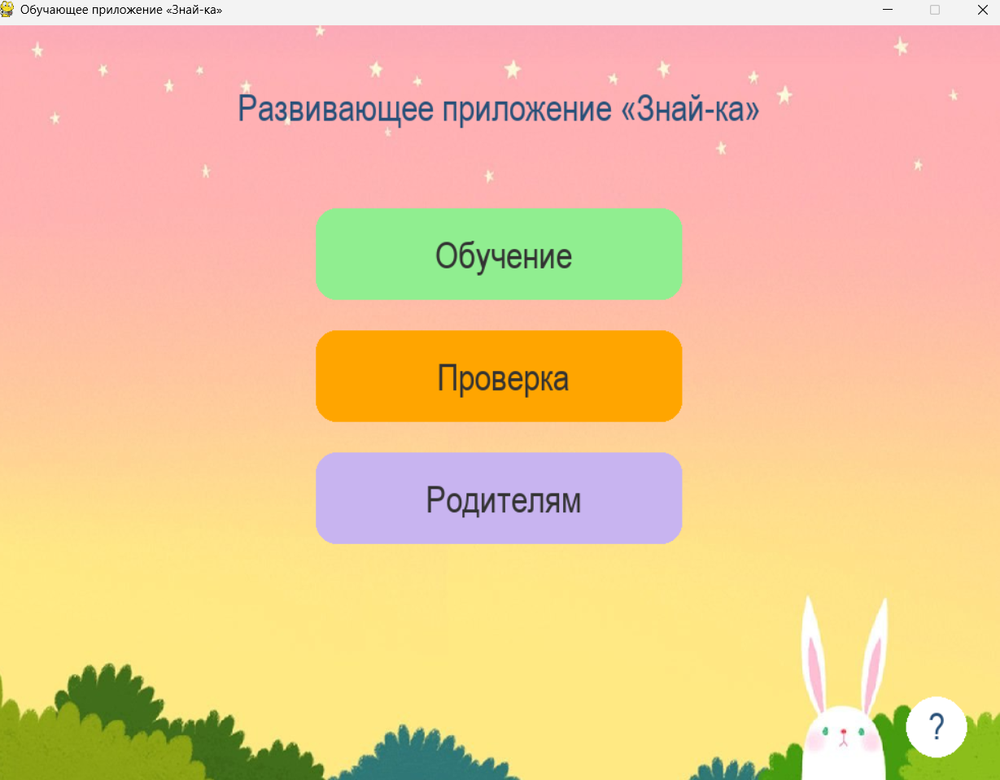
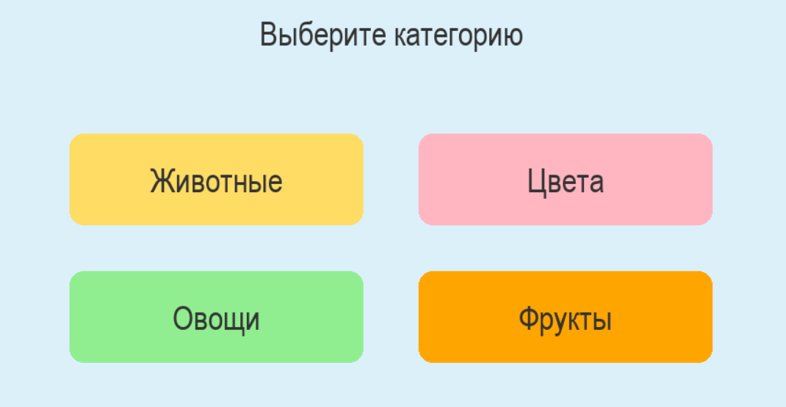
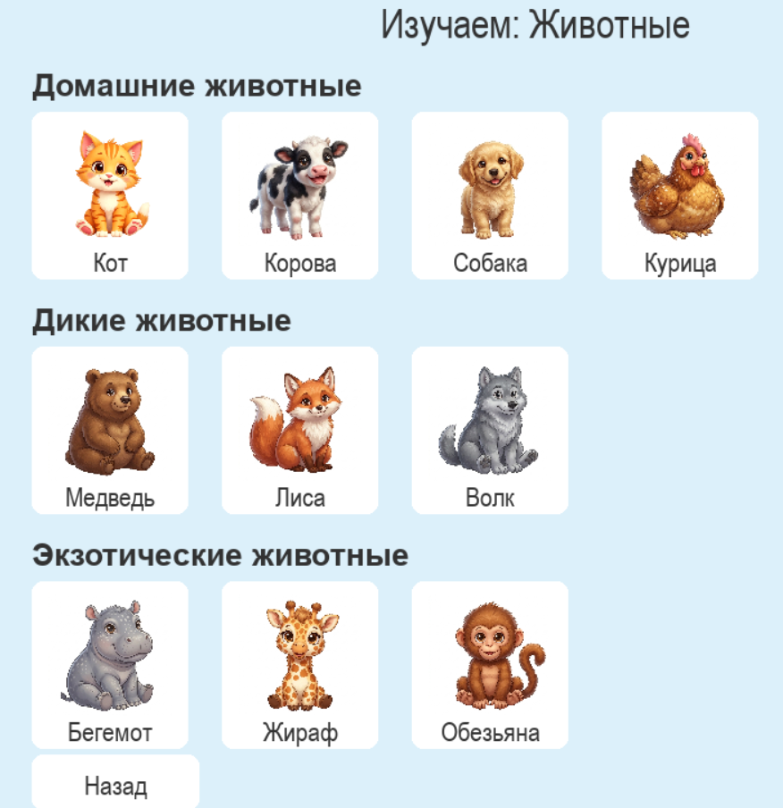
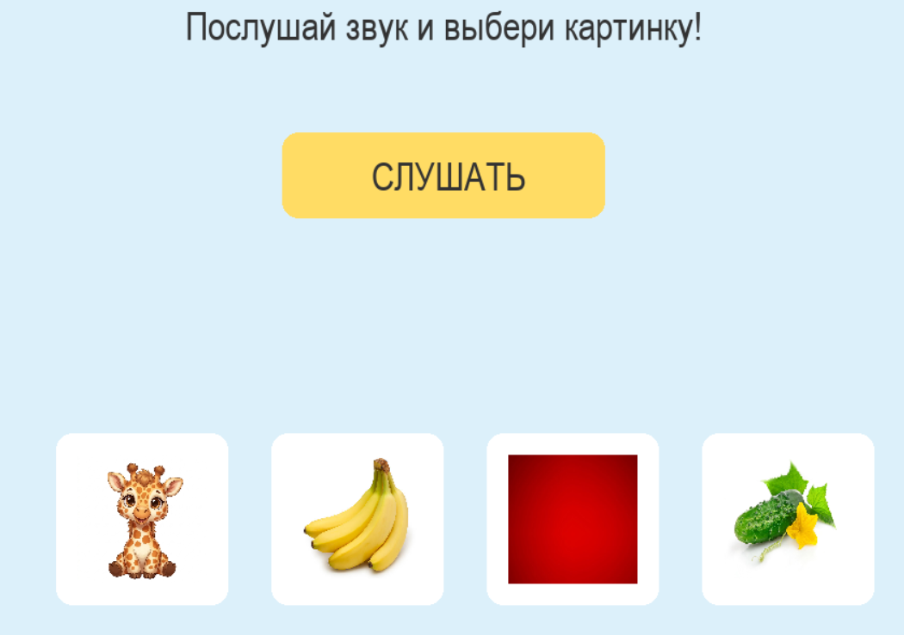

# 🐰 Знай-ка — Развивающее приложение для детей

Интерактивное обучающее приложение для детей дошкольного и младшего школьного возраста. Помогает изучать животных, цвета, овощи и фрукты в игровой форме — через картинки и звуки.

---

## 📸 Скриншоты

### Главное меню


### Выбор категории


### Режим обучения — Животные


### Режим проверки — угадай по звуку


---

## 🎯 Возможности

- **Обучение** — изучение слов по категориям с картинками и озвучкой. Нажми на карточку — услышишь название.
- **Проверка** — игра «Послушай звук и выбери картинку». Ребёнок слышит слово и выбирает правильное изображение из четырёх вариантов.
- **Родителям** — статистика правильных и неправильных ответов по каждой категории, сохраняется между сессиями.
- **4 категории**: Животные (домашние / дикие / экзотические), Цвета, Овощи, Фрукты.

---

## 🚀 Установка и запуск

### Требования

- Python 3.8+
- Библиотека `pygame`

### Шаги

```bash
# 1. Клонируй репозиторий
git clone https://github.com/n0vaira/course_work-znaika.git
cd course_work-znaika

# 2. Установи зависимости
pip install pygame

# 3. Запусти приложение
python main.py
```

> ⚠️ Запускать нужно из корневой папки проекта, так как приложение ищет папку `images/` и файл `stats.json` относительно рабочей директории.

---

## 📁 Структура проекта

```
course_work-znaika/
│
├── main.py              # Основной файл приложения
├── stats.json           # Статистика ответов (создаётся автоматически)
│
├── images/              # Картинки для карточек
│   ├── cat.png
│   ├── dog.png
│   ├── bear.png
│   └── ...
│
└── sounds/              # Аудиофайлы с названиями слов
    ├── cat.mp3
    ├── dog.mp3
    └── ...
```

---

## 🕹️ Как пользоваться

### Режим «Обучение»
1. Нажми кнопку **«Обучение»** в главном меню.
2. Выбери категорию: Животные, Цвета, Овощи или Фрукты.
3. На экране появятся карточки с картинками и подписями.
4. **Нажми на любую карточку** — приложение произнесёт название вслух.
5. Нажми **«Назад»**, чтобы вернуться к выбору категории.

### Режим «Проверка»
1. Нажми **«Проверка»** в главном меню.
2. Выбери категорию.
3. Нажми жёлтую кнопку **«СЛУШАТЬ»** — прозвучит название предмета.
4. Выбери правильную картинку из четырёх вариантов.
5. Приложение покажет результат: ✅ «Правильно! Молодец!» или ❌ «Попробуй ещё раз!»

### Раздел «Родителям»
- Показывает количество правильных и неправильных ответов по каждой теме.
- Статистика сохраняется в файле `stats.json` и не сбрасывается при перезапуске.

---

## 🛠️ Технологии

| Инструмент | Назначение |
|---|---|
| Python 3 | Основной язык |
| Pygame | Графика, звук, обработка событий |
| JSON | Хранение статистики |

---

## 📦 Категории и содержание

| Категория | Элементы |
|---|---|
| 🐾 Домашние животные | Кот, Корова, Собака, Курица |
| 🌿 Дикие животные | Медведь, Лиса, Волк |
| 🌍 Экзотические животные | Бегемот, Жираф, Обезьяна |
| 🎨 Цвета | Синий, Зелёный, Красный, Жёлтый |
| 🥦 Овощи | Капуста, Огурец, Картошка, Помидор |
| 🍎 Фрукты | Яблоко, Банан, Клубника, Апельсин |

